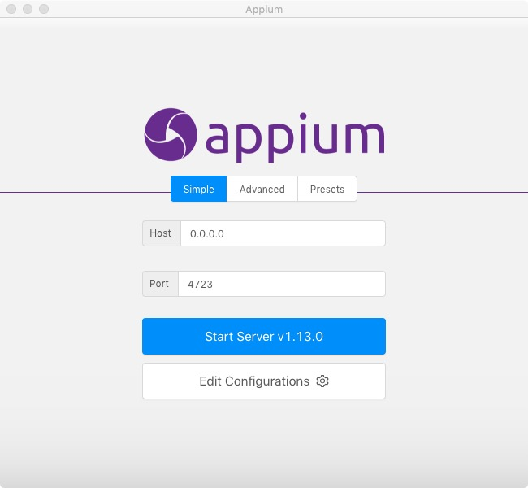
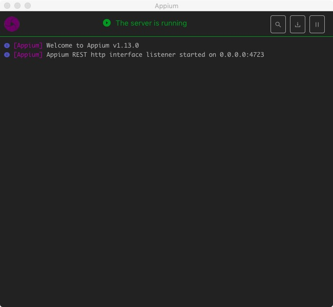
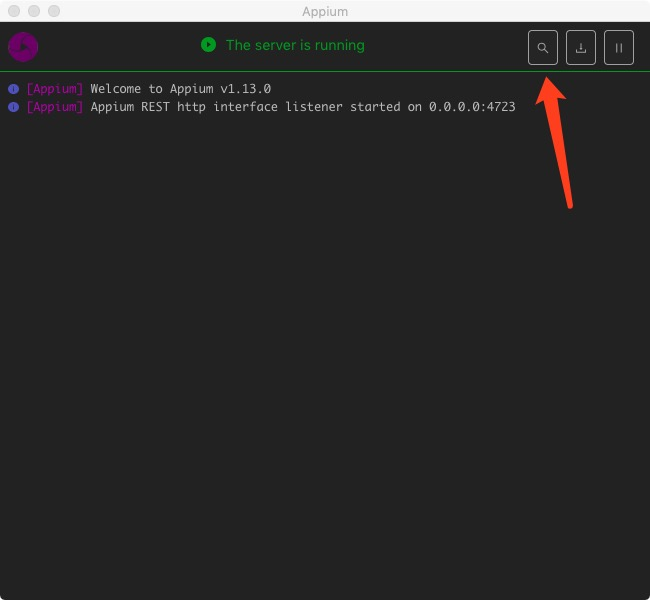
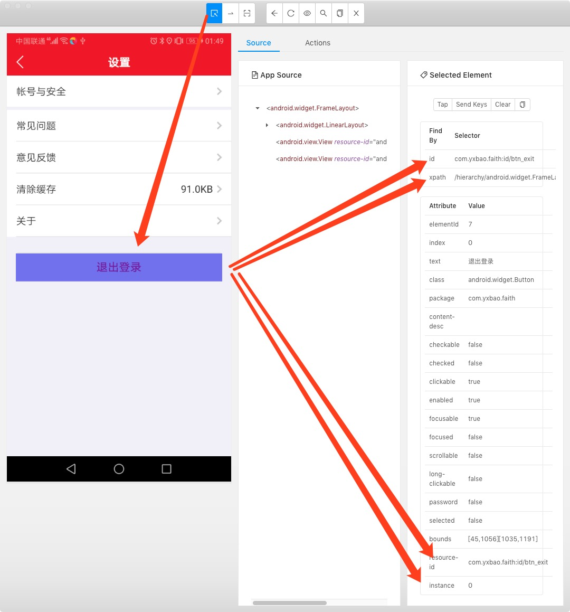

# Android App自动化测试

## 开发流程说明
1. 利用AppiumDesktop查看手机的元素
2. 利用Python编写基于Appium的代码来控制真机APP
3. 得到真机的内容，保存它用?

## 开发环境（以我自己的开发机为例）
1. 操作系统：Mac 10.14.6 (18G95)
2. 依赖框架：[Appium](https://github.com/appium/appium)
3. 开发语言：Python3.7
4. 开发手机：华为 Honor 7X

## Python3的requirements.txt
```
requests==2.22.0
schedule==0.6.0
pyquery==1.4.0
numpy==1.17.2
selenium==3.141.0
lxml==4.3.3
opencv_python==4.1.1.26
pyppeteer==0.0.25
Pillow==6.1.0
Appium_Python_Client==0.47
beautifulsoup4==4.8.0
```
## 开发准备
1. 下载操作系统对应的 [AppiumDesktop](https://github.com/appium/appium-desktop)（该框架用来联结手机与PC的通信）
2. 下载Android Studio，有条件的去Google下，没有条件的，去 [AndroidDevtools](https://www.androiddevtools.cn/)下，安装好后，使用SDK Manager把手机对应的android版本的tool, platforms,还有platform-tools，都下载好，并且设置好下面几个变量
   ```
    JAVA_HOME
    ANDROID_HOME
    把 tool, platforms, platform-tools, build-tools都加入到 PATH 中去
   ```
3. 手机打开开发者模式，查看android的版本号，联结到PC后，使用adb devices 命令行，查看手机的设备号，备用
4. 下载好对应的手机APP到本机，最好是开发者模式生成的包

## 具体开发流程
1. 使用 appt 命令查看app包的Package和Activity名称
   ```
   aapt dump badging path/to/app.apk
   ```
    实际代码
   ```
   ➜  29.0.2 pwd
    ~/Library/Android/sdk/build-tools/29.0.2
    ➜  29.0.2 ./aapt dump badging ~/Downloads/jiedaibao_3170.apk
    package: name='com.rrh.jdb' versionCode='3170' 
    ...
    platformBuildVersionName='8.0.0'
    ...
    sdkVersion:'16'
    ...
    launchable-activity: name='com.xxx.xxx.maintab.LaunchActivity'
    ...  
   ```
   搜索关键字 package 和 launchable-activity,备用

2. 启动AppiumDesktop，联结好手机


点击下面这个按钮，开启查看页面元素


```
    {
    "app": "~/Downloads/jiaduobao.apk",
    "platformName": "Android",  
    "platformVersion": "9",
    "noReset": true,
    "deviceName": "28PNW18310000441",
    "udid": "28PNW18310000441",
    "appPackage": "com.wlj.jdb",
    "appActivity": "com.wlj.jdb.JDBLaunchActivity"
    }
```

参数名称|说明
---|---
app|本地保存的apk文件的路径，绝对路径
platformName | Android 是安卓手机来运行，所以写Android
platformVersion | 手机系统安装的版本，当前手机是 9 就写 9 ，不用写9.0
deviceName| 手机的设备号，上面我们用 adb devices获取到的
udid | 填写上面一样的就行
appPackage | 上面获取到的package 
appActivity | 上面获取到的launch activity

然后点击【start session】

3. 在模拟器上查找元素


   * 通过resource_id
    ```
        element = page.driver.find_element_by_id()
    ```
   * 如果有多个同名的 resource id,通过下标进行
    ```
        element = page.driver.find_elements_by_id()[index]
    ```
   * 通过xpath
    ```
        element = page.driver.find_element_by_xpath()
    ```
   * 通过 android uiautomator
    ```
        rule = 'className("android.Widget.TextView").instance("0")'
        element = page.driver.find_element_by_android_uiautomator(rule)
    ```

4. 操作这个元素或者获取值
   
    ```
    element.click()            #点击这个元素，一般用来跳转
    element.text               #获取这个元素的文本
    for element in elements:   #如果获取到元素数组的话，可以用循环来进行操作
        element.text
   ```
